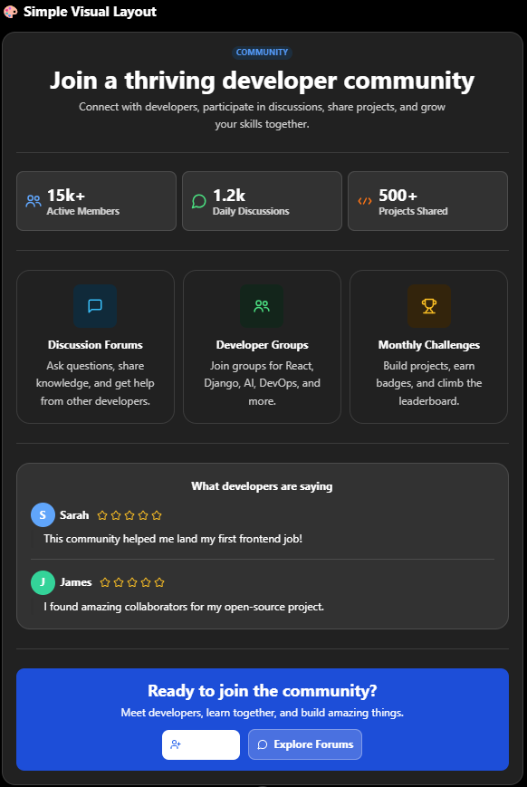

**1. First prompt:**
Suppose I want to build a web developer focused website. Which has sections like a navbar, a banner section to encourage people, a speaker section for knowing and connecting with famous developers, a pricing plan section for those who want to join for advanced features. So now I want to add a section related to this. I have already thought of a payment method section. But as a role of a web developer what would you suggest me ? Some better and innovative idea?

**2. Second prompt (after AI gave me more options):**
I like the idea of community section. Can you give me a visual example how should i create this? Just a simple desgin, i'll use html and css only.

**3. It provided me this example. With it's help I created my own design.**

